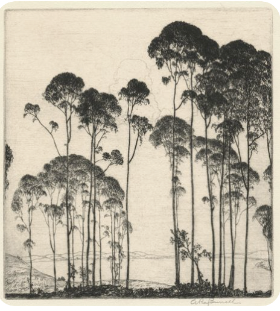
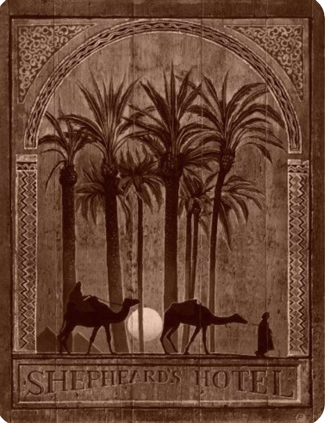
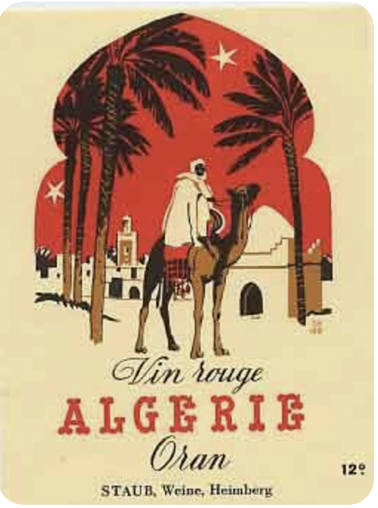
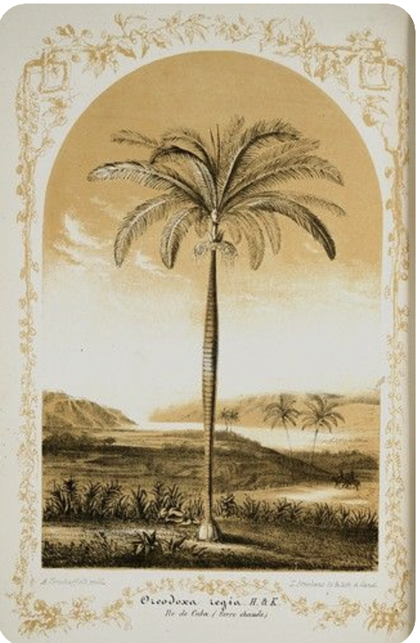
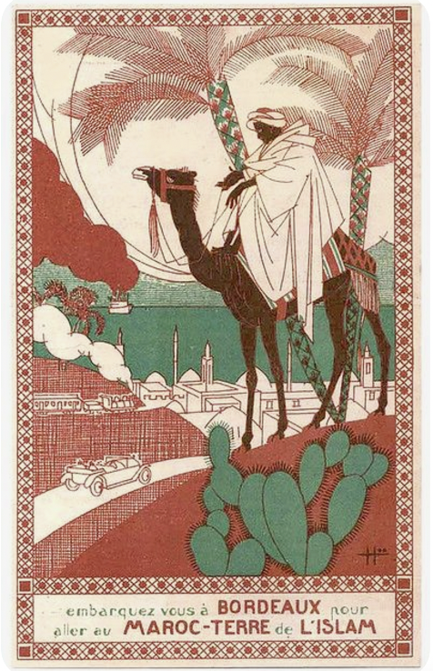
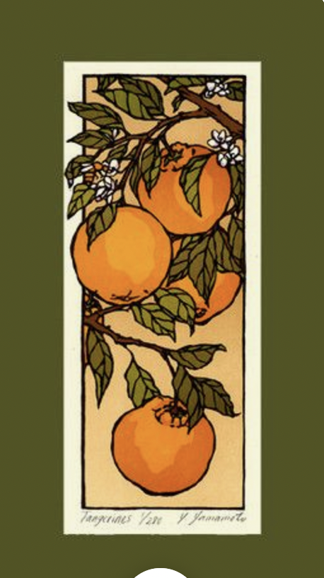
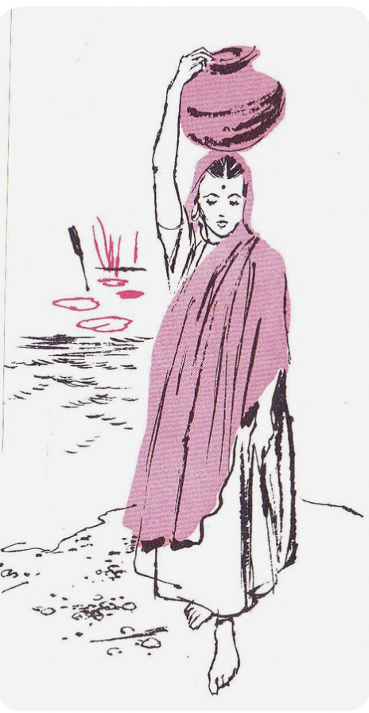

# Eucalyptus Scrollytelling

## Background

"The Eucalyptus: The King of Jews" is a storytelling experience that explores the cultural, historical, and ecological significance of the Eucalyptus tree in Israel. Through illustrations and insightful storytelling, the project presents a visually immersive journey that examines the eucalyptus tree as both a symbol and a subject of debate.

### Inspiration

The inspiration comes from the deep-rooted presence of the eucalyptus tree in Israel. Serving as both a natural and symbolic entity, the tree holds different meanings for different groups.
The experience will use a vintage color palette, and it's visuals will take inspiration from biritish colonial posters and literature, ensuring a balance between education and aesthetic appeal.

### Purpose

"Eucalyptus Scroll" serves a dual purpose: to inform and provoke thought. The project educates users about the historical role of eucalyptus trees in Israel while inviting interpretation regarding their symbolic meaning. By incorporating an edited version of an article from Haaretz—["The Giant of the Negev: The Battle Over Israel’s Eucalyptus Trees"](https://www.haaretz.com/israel-news/2020-02-21/ty-article/.premium/the-giant-of-the-negev-the-battle-over-israels-eucalyptus-trees/0000017f-df8f-df9c-a17f-ff9f350c0000)—the project offers a layered narrative that blends historical facts with contemporary discussions. The goal is to foster a nuanced understanding of the eucalyptus tree’s role in Israel’s landscape and identity as the symbol of the zionist movement.

### Style

The storytelling style of "Eucalyptus Scroll" merges captivating illustrations, evocative images, and data driven visualizations. Pastel and earthy tones create a calming visual atmosphere, while the artistic approach offers an interpretative exploration of the eucalyptus tree’s transformation in the israeli view. 

  
  
  

  
  
  

  

### Story Structure

The narrative unfolds through an interactive scrolling journey that explores different facets of the eucalyptus tree’s story. It begins with its introduction to Israel, moves through its environmental and cultural impact, and delves into its symbolic interpretations. The project integrates:

- Illustrations to go along and explain the written text.
- Data visualizations to explore environmental consequences.
- Excerpts from the Haaretz article to ground the narrative in factual reporting.

As users scroll, they transition through a rich, layered story that deepens their understanding and appreciation of the eucalyptus tree’s significance.

### Technicalities

The project will be built using JavaScript, likely incorporating React JS for structure. ScrollMagic will enhance the scrolling interactions, while OpenRefine will assist in organizing data. Illustration tools and GIF animations will be used to bring the story to life, ensuring a dynamic and engaging experience.

## Best- and Worst-Case Scenarios

### Best Case
- A complete 6 section scrolled experience with hand-drawn interactivity visuals.
- Integration of an interactive timeline with key historical events.
- Hover animations and other micro-interactions to enhance storytelling.
- Successfully conveys and creates a conversation about the symbolic aspects of the eucalyptus tree and the Jewish settlement in Israel.

### Worst Case
- A basic 4 section scrolling page (Introduction, History, Symbolism, Debate).
- Limited visuals due to time constraints.
- Partial implementation of interactive timeline and animations.
- The project remains a work in progress, with potential for future improvment.

## Timetable

Weekly, to be read as "by ${Date} ${Milestone} will be done".

| Date   | Milestone |
|--------|-----------|
| 20.1.  | Edit and structure the article for the project |
| 28.01. | Create 2-4 illustrated visuals |
| 3.2.   | Combine text and graphics into a wireframe |
| 17.2.  | Select JS libraries and build project skeleton |
| 01.3.  | Develop the first 2-3 sections |
| 10.3.  | Complete and integrate all sections |
| 15.03. | Submission |
