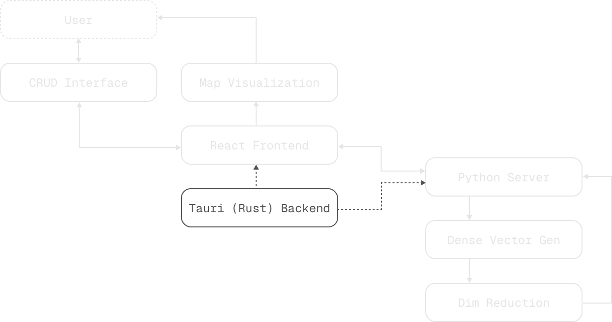
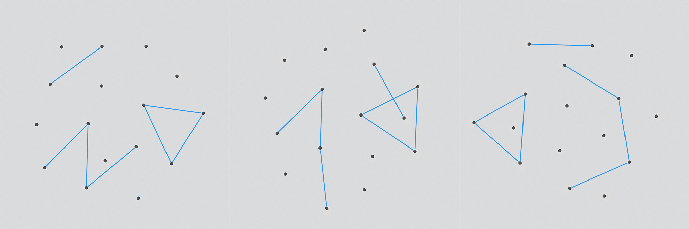

<h1>&nbsp;&nbsp;&nbsp;knoto - Project Plan</h1>

### Motivation

The development of _knoto_ originated from growing frustration with conventional note-taking during my bachelor studies. Despite multiple iterations of organizational systems, the accumulated information became increasingly fragmented across folder structures. Each attempt to impose order resulted in more complexity, eventually reaching a point where the system hindered rather than supported the learning and understanding process. This experience highlighted the need for a more sophisticated approach - one that would eliminate the cognitive overhead of manual organization while maintaining the accessibility of information. Rather than forcing structure onto content, the system should derive it naturally from the material itself.

### Project Description

_knoto_ is a tool to collect and explore information spatially. In its core, the application works like an infinite whiteboard on which user inputs are clustered depending on their content. Automating the placement ensures consistent and reliable organization, while minimizing the barrier to include additions. The resulting knowledge topology not only displays relations between entries but also serves as a mnemonic device when trying to recollect the location of a particular note.

To place inputs strategically without user intervention, some kind of machine intuition is necessary. The algorithm has to evaluate arbitrary information in regard to the existing corpus of notes. There are several pre-trained transformer based models that allow text to be converted into highly dimensional vector embeddings, still containing semantic characteristics of the input. These can then be reduced to a two or three-dimensional position vector using a projection algorithm. During this dimensionality reduction, the goal is to preserve as much distance between individual data points as possible.

Even though the visual design aspect of this project is not the main focus, the user interface plays a crucial role in the usability of the end result. Since the frontend will be built on web technologies, there is a vast selection of libraries available. Implementing the knowledge map visualization using a suitable existing framework will offer more stability than a custom solution, while also freeing up development time that can be utilized to ensure better placement predictions.

### Categorization

- Software Development
  - format: Desktop application
  - tool for information organization (creatives, researchers, students)
- Experimentation and Research
  - How can semantically related positions be extracted from text using machine learning algorithms?
    - How useful are dense vector generation and dimensionality reduction?
    - How are they implemented?
  - What learning strategies are proven in cognitive science and can those somehow be applied to the project?
- Pipeline Development
  - How can the machine learning selected algorithms be combined and integrated into a desktop application?

### System Diagram

The application will consist of two distinct components: A frontend based on `React` and a backend running as a `Python` server. Both are managed by `Tauri`, a framework to develop cross-platform applications. Upon the application being launched, a headless web view window will open while also spawning the Python server as a sidecar. From that point onwards, all IPC (inter process communication) is run directly between the React frontend and the Python server via API requests.

Once a user enters a a new entry via the CRUD (Copy, Read, Update, Delete) interface, the content is sent through the frontend to the Python server. There, based on the text, a highly dimensional vector is generated. This dense vector is then run through a dimensionality reduction algorithm, resulting in a low dimensional vector that can be interpreted as a spatial position (two or three dimensional). The result is then sent back through an API response to the frontend. Here, all notes are displayed in the map visualization view where the user can explore and modify existing entries through the CRUD interface view.

This schematic does not yet include database management. As I really like how Obsidian wraps around an OS folder with your notes as individual Markdown files, I would also like to rely on a file based data structure.

### Unique Selling Point

While several established tools address different aspects of knowledge management and spatial information organization, _knoto_ differentiates itself through the unique approach to automated and stable spatial arrangement. Existing solutions like [Miro](https://miro.com/de/) focus on collaborative aspects, while requiring manual whiteboard organization. [Mymind](https://mymind.com/) provides automated tagging and text exploration capabilities but lacks spatial context. Tools like [Obsidian](https://obsidian.md/) and [Logseq](https://logseq.com/) implement graph views for knowledge exploration, [Remnote](https://www.remnote.com/) even offers quizzing features, but all of their visualizations are highly volatile.

> Obsidian: The same vault in graph view without any changes launched three times

_knoto_ aims to combine automated information entry organization with a stable spatial access to the collected notes. The lack of reorganization after placement allows users to build a lasting intuition about where new information relates to existing entries. This strengthens the ability to recall that information later (Brown et al., 2014, p.5) and thereby serves as a mnemonic device. Furthermore, at all times looking at a whole cluster of knowledge might reveal previously unseen relations among topics that would have otherwise gone unnoticed.

### Expected Outcome

<table>
  <tr>
    <th>Solution Tier</th>
    <th>Features</th>
  </tr>
  <tr>
    <td>Baseline</td>
    <td>
      <ul>
        <li>functioning desktop application</li>
        <ul>
          <li>Tauri + Python backend with IPC via API calls</li>
          <li>TauPy template release on GitHub</li>
        </ul>
      </ul>
      <ul>
        <li>graphical user interface (React + Tailwindcss)</li>
        <ul>
          <li>CRUD (Copy, Read, Update, Delete) operations</li>
          <li>map visualization (D3)</li>
          <li>basic navigation (mouse, trackpad, keyboard)</li>
        </ul>
      </ul>
      <ul>
        <li>inference pipeline</li>
        <ul>
          <li>semantic coordinate output inferred from text input</li>
        </ul>
      </ul>
    </td>
  </tr>
  <tr>
    <td>Ideal</td>
    <td>
      <ul>
        <li>
          semantically coherent coordinate generation that ensures consistent
          and stable knowledge topology
        </li>
        <li>
          continuous learning implementation to allow the underlying neural
          networks to adapt to new notes and user preference
        </li>
        <ul>
          <li>manual placement correction in the UI as feedback mechanism</li>
          <li>model updating through fine-tuning</li>
        </ul>
      </ul>
      <ul>
        <li>graphical user interface (React + Tailwindcss)</li>
        <ul>
          <li>CRUD (Copy, Read, Update, Delete) operations</li>
          <li>map visualization (D3)</li>
          <li>basic navigation (mouse, trackpad, keyboard)</li>
        </ul>
      </ul>
      <ul>
        <li>inference pipeline</li>
        <ul>
          <li>semantic coordinate output inferred from text input</li>
        </ul>
      </ul>
    </td>
  </tr>
</table>

### Vision and Future Work

- further usage and analysis of the resulting data
  - automatic direct note linking (as an extension to clustering) to make connections even more clear
  - knowledge gap prediction to assist with learning and research tasks
  - temporal analysis of knowledge development to research the learning process itself
  - using the knowledge topology as a fact-checker for generative modeling by path-tracing through the information database
  - implement a quizzing mechanic to increase the retention aspect of the tool even further (Brown et al., 2014, p.43)
- feature extensions
  - support for various other media types (eg. images, sound, video etc.)
  - semantic search to be able to find individual notes quicker while still contextualizing with spatial neighbors
  - mobile version for a lower barrier to add spontaneous additions (portability)
    - cloud synchronization
    - AppStore release

### Subjective Challenges

- developing my abilities with technologies I have not previously used:
  - `Tauri` as a cross-platform application framework
  - `React` as a frontend framework
  - `D3` for the map visualization
- research and application of machine learning algorithms for `text embedding` and `dimensionality reduction` (preliminary selection of algorithms is subject to change):
  - `sBERT` (Sentence-BERT) for text embedding (Reimers & Gurevych, 2019)
  - `t-SNE` (t-distributed stochastic neighbor embedding) for dimensionality reduction (van der Maaten & Hinton, 2008)
  - `UMAP` (Uniform Manifold Approximation and Projection) as an alternative to t-SNE (McInnes et al., 2020)
- most impactful key problems towards the ideal solution:
  - implementing a pipeline that is capable of generating positions with actual semantic coherency
  - turning the system into a continuous learning application that can adapt to new notes and user preference

### Roadmap

The roadmap consists of multiple steps that are dependent on each other and is therefore subject to change. I will try to keep an updated version of the roadmap on the [project documentation website](https://knoto.whatphilipdoes.com/roadmap/).

#### Already Completed

<table>
  <tr>
    <th>Time Frame</th>
    <th>Milestone</th>
    <th>Work Packages</th>
  </tr>
  <tr>
    <td><code>01.11.2024 - 26.11.2024</code></td>
    <td>System Architecture</td>
    <td>
      <ul>
        <li>techstack evaluation; goal → desktop application</li>
        <li>framework selection</li>
      </ul>
    </td>
  </tr>
  <tr>
    <td><code>27.11.2024 - 06.01.2025</code></td>
    <td>Framework Template</td>
    <td>
      <ul>
        <li>Python</li>
        <ul>
          <li>backend access → setting up FastAPI & Uvicorn</li>
          <li>bundling → Pyinstaller</li>
        </ul>
        <li>Tauri</li>
        <ul>
          <li>configuration for sidecar usage and CORS setup</li>
          <li>sidecar management</li>
          <ul>
            <li>automatic process spawn upon launch</li>
            <li>automatic process kill upon exit</li>
          </ul>
        </ul>
        <li>React</li>
        <ul>
          <li>setup and configuration</li>
        </ul>
        <li>Github</li>
        <ul>
          <li>workflow setup and configuration</li>
        </ul>
      </ul>
    </td>
  </tr>
  <tr>
    <td><code>07.01.2025 - 15.01.2025</code></td>
    <td>Documentation Template</td>
    <td>
      <ul>
        <li>Astro Project</li>
        <ul>
          <li>configuration and setup</li>
          <li>Expressive Code setup</li>
          <li>layout and design</li>
        </ul>
        <li>Github</li>
        <ul>
          <li>workflow setup and configuration</li>
        </ul>
      </ul>
    </td>
  </tr>
</table>

#### Upcoming

<table>
  <tr>
    <th>Time Frame</th>
    <th>Milestone</th>
    <th>Work Packages</th>
  </tr>
  <tr>
    <td><code>16.01.2025 - 31.01.2025</code></td>
    <td>Embedding Exploration</td>
    <td>
      <ul>
        <li>feasibility evaluation for continuous learning implementation</li>
        <ul>
          <li>LNN (Liquid Neural Network)</li>
          <li>further research into alternative approaches</li>
        </ul>
        <li>study and test traditional machine learning algorithms</li>
        <ul>
          <li>sBERT (Sentence BERT)</li>
          <li>t-SNE (t-distributed stochastic neighbor embedding)</li>
          <li>UMAP (Uniform Manifold Approximation and Projection)</li>
          <li>KNN (k-nearest neighbor)</li>
        </ul>
        <li>come up with a pipeline architecture design prototype</li>
      </ul>
    </td>
  </tr>
  <tr>
    <td><code>01.02.2025 - 10.02.2025</code></td>
    <td>Minimal UI Implementation</td>
    <td>
      <ul>
        <li>CRUD (Copy, Read, Update, Delete) operations in three workflows</li>
        <ul>
          <li>create new notes</li>
          <li>read and update existing notes (hybrid view)</li>
          <li>delete notes</li>
        </ul>
      </ul>
      <ul>
        <li>topology visualization</li>
        <ul>
          <li>topology implementation using webGL based features of D3</li>
          <li>
            navigation implementation of movement and zoom (mouse, trackpad and
            keyboard)
          </li>
          <li>text and visualization balancing</li>
        </ul>
      </ul>
      <ul>
        <li>transitioning between topology and CRUD interface</li>
      </ul>
    </td>
  </tr>
  <tr>
    <td><code>11.02.2025 - 12.02.2025</code></td>
    <td>Core Data Structure</td>
    <td>
      <ul>
        <li>OS filesystem based database approach</li>
        <li>API data transfer protocol implementation (Pydantic)</li>
      </ul>
    </td>
  </tr>
  <tr>
    <td><code>13.02.2025 - 20.02.2025</code></td>
    <td>Embedding Pipeline Implementation</td>
    <td>
      <ul>
        <li>
          dependent on pipeline architecture (result of Embedding Exploration)
        </li>
        <li>time allotment for training / fine-tuning models</li>
      </ul>
    </td>
  </tr>
  <tr>
    <td><code>21.02.2025 - 01.03.2025</code></td>
    <td>Polishing</td>
    <td>
      <ul>
        <li>time allotment for bug fixing and stability improvements</li>
      </ul>
    </td>
  </tr>
  <tr>
    <td><code>01.03.2025</code></td>
    <td>MVP Completion</td>
    <td>
      <ul>
        <li>Preliminary Alpha Release Date (Subject to change)</li>
      </ul>
    </td>
  </tr>
  <tr>
    <td><code>02.03.2025 - 10.03.2025</code></td>
    <td>Continuous Learning Implementation</td>
    <td>
      <ul>
        <li>
          optional and additional time allotment depending on feasibility study
          in the Embedding Exploration
        </li>
      </ul>
    </td>
  </tr>
  <tr>
    <td><code>02.03.2025 - 10.03.2025</code></td>
    <td>UI Refinement</td>
    <td>
      <ul>
        <li>
          alternative fallback in case there is time left and continuous
          learning was deemed infeasible in the Embedding Exploration
        </li>
      </ul>
    </td>
  </tr>
  <tr>
    <td><code>15.03.2025</code></td>
    <td>Final Submission</td>
    <td>
      <ul>
        <li>Fixed submission date for the project files and documentation</li>
      </ul>
    </td>
  </tr>
</table>

---

### Literature

- Brown, P. C., Roediger III, H. L., & McDaniel, M. A. (2014). Make it stick: The Science of Successful Learning. The Belknap Press of Harvard University Press.
- Reimers, N., & Gurevych, I. (2019). Sentence-BERT: Sentence Embeddings using Siamese BERT-Networks (No. arXiv:1908.10084). arXiv. https://doi.org/10.48550/arXiv.1908.10084
- van der Maaten, L., & Hinton, G. (2008). Visualizing data using t-SNE. Journal of Machine Learning Research, 9(86), 2579–2605.
- McInnes, L., Healy, J., & Melville, J. (2020). UMAP: Uniform Manifold Approximation and Projection for Dimension Reduction (No. arXiv:1802.03426). arXiv. https://doi.org/10.48550/arXiv.1802.03426
