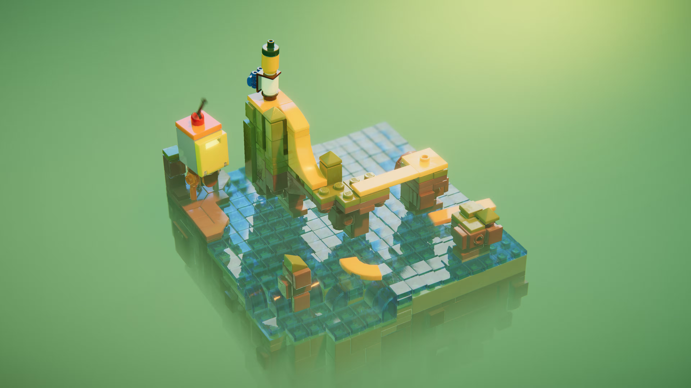
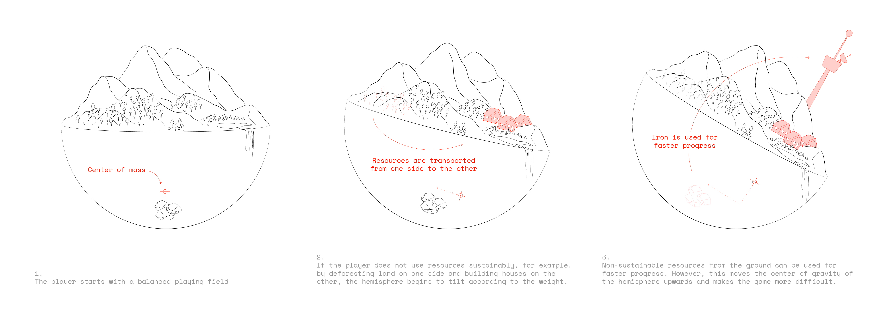
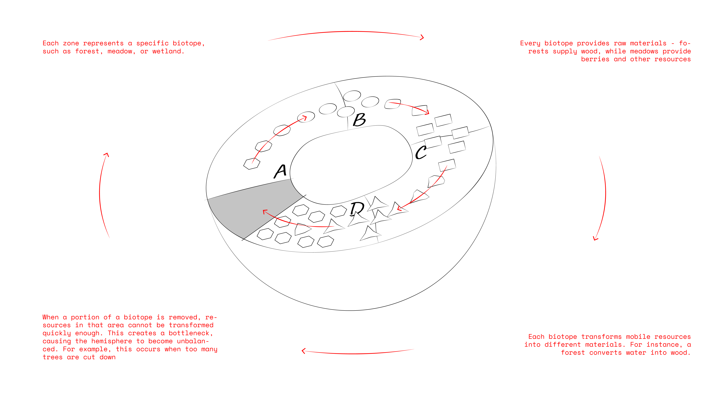

# Regime Shift

## Personal Motivation

- Fascination with connecting game mechanics and real systems
- Interest in developing gameplay mechanics
- Desire to make ecological relationships experientially understandable
- Challenge of technical implementation of complex physical systems
- Goal to develop own game through sponsorship

## Contextual Information & Related Work

Inspired by games such as:

- **[Eco](https://play.eco/)** - Complex ecosystems and player mechanics
- **[From Dust](https://store.steampowered.com/app/33460/From_Dust/)** - Nature manipulation and physics
- **[Minecraft](https://www.minecraft.net/)** - Voxel-based worlds and resource management
- **[Stacklands](https://store.steampowered.com/app/1948280/Stacklands/)** - A village builder where you stack cards to collect food, build structures, and fight creatures
- **[Orchestrate](https://gamesforcrows.itch.io/orchestrate)** - Conduct the workers of a small medieval town in this sound-based resource management game
- **[LEGO® Builder's Journey](https://www.lightbrick.com/builders-journey)** - Visual inspiration of an abstract game

_Screenshot of LEGO® Builder's Journey_

## Current Relevance:

- Growing awareness of ecological relationships
- Need for interactive educational tools for environmental topics
- Trend towards physics-based game mechanics

## Description

Regime Shift is a survival-building game that presents players with a dual challenge: surviving in a living but fragile world and maintaining ecological balance. The game world is located on the inside of a hemisphere, whose balance is influenced by every action of the player.

The central element is a dynamic ecosystem, represented as interconnected resource fields on the playing field. Each field represents a part of the ecological cycle and transforms resources: forests absorb water and produce food, animals consume this and fertilize meadows, which in turn generate new resources. This continuous energy flow is the heart of the game. If one part of the system is overused – for example, through excessive deforestation – a resource bottleneck occurs (e.g., unused water), which endangers the balance of the hemisphere.

Players can fail in two ways: either through the tipping of the hemisphere when the ecosystem reaches its tipping point, or through failure to meet their own basic needs such as food and warmth. This duality forces a constant balancing act between resource use and system maintenance.

The game world is expected to be in a voxel style, with each voxel representing a specific resource with defined weight. A time management system provides additional dynamics: resources regenerate naturally while constructed structures decay. The use of non-sustainable resources like coal or iron enables faster progress but shifts the hemisphere's center of gravity upward and makes balancing more difficult.

For survival, players must construct basic structures: houses for protection from cold, cooking stations for food preparation, and workbenches for tools. Beyond this, they can also intervene in the ecosystem itself by building special structures:
To actively influence the ecosystem, players can construct special structures, such as aqueducts that transport excess water to dried-out areas and thus help preserve the hemisphere's balance.

These intervention possibilities allow players to act as active managers of the ecosystem and balance out inequalities. The game thus serves as an interactive metaphor for real ecological systems: excessive exploitation or uneven development leads to systemic problems that manifest in the physical inclination of the hemisphere. Players must learn to align their immediate needs with the long-term requirements of a stable ecosystem, acting as both users and guardians of the system.

These conceptual considerations form the current planning basis of the project but can be adjusted during development based on technical possibilities and playtesting results.

## Categorization

### Creative / Artistic Development

- Development of a unique voxel art style
- Visual representation of resources and their states
- Design of the hemisphere world
- Feedback systems for player states

### Audio-visual Design

- Atmospheric sound design for resource extraction
- Visual effects for system states

### Software Development

- Implementation in Unity
- Development of the voxel system
- Physics engine for hemisphere balance
- Resource management system

### Algorithms

- Weight calculations and balance simulation
- Resource regeneration systems
- Decay algorithms for structures

### Research / Experimentation

- Analysis of existing games
- Visual research

## System Diagram

- Working with Unity and potentially creating assets with Cinema 4D

## Unique Selling Points

- Innovative connection of physics and ecology
- Unique hemisphere mechanics
- Metaphorical representation of environmental problems
- Emergent gameplay through complex systems

## Expected Results

My goal is to create the assets needed for a sponsorship application. This generally includes:

Text Assets:

- A convincing project description
- Detailed technical documentation of your project
- A clear development and timeline
- Information about your development team and its experience

Visual Assets:

- High-quality screenshots of your game/project
- Concept art and design documents
- UI/UX designs and mockups
- Technical visualizations (if relevant)

Video Assets:

- A professional gameplay trailer (about 2-3 minutes)
- A "vertical slice" demo showing core mechanics
- Optional: A short team introduction video
- Technical demonstration videos

### Best possible solution

1. Project Documentation

   - Project description
     - Detailed explanation of the game concept with core components
     - Development planning with milestones
   - Developer profile

2. Design Documentation

   - Concept Art
     - Basic character model with animation
     - Core environmental elements
     - Most important interactive objects
   - Visual Style Guide
     - Color palettes and material concepts
     - Asset design guidelines
   - User Feedback System
     - Visual feedback concept for player states
     - Integration into UI
   - Audio Design
     - Basic sound effects for core mechanics

3. Technical Documentation

   - Core Systems
     - Architecture concept and system structure
     - Data management
   - Input System
     - Control schema

4. Prototype

   - Playable demo of core mechanics:
     - Functioning hemisphere mechanics
     - Basic ecosystem with resource cycle
     - Basic player interactions
     - Atmospheric design with sound and visuals

5. Visual Assets
   - In-game screenshots
   - Gameplay trailer (1-2 minutes)

### Baseline solution

1. Project Documentation

   - Project description
     - Detailed explanation of the game concept with core components
     - Development planning with milestones
   - Developer profile

2. Design Documentation

   - Concept Art
     - Character concept
     - Environment concepts
   - Visual Style Guide
     - Color palette
     - Asset guidelines

3. Technical Documentation

   - Core Systems
     - System concept

4. Prototype

   - Separate technical experiments for:
     - Basic hemisphere mechanics function
     - Simplified ecosystem simulation
     - Basic player interactions

5. Visual Assets
   - Concept screenshots

## Vision and Future Work

The main goal of the project is to develop a prototype and application documents for "Regime Shift" that serve as a basis for sponsorship applications. Successful submission to sponsors could create the financial basis for further development of the game. With additional funding, the game could be expanded beyond the initial prototype into a complete indie game.

## Challenge of your comfort zone

The challenge lies in developing a game without prior experience. With only limited prior knowledge in Unity, my task is not only to conceive innovative game mechanics but also to implement them technically. I must therefore learn technologies and development methods while realizing a complex game concept.

## Project plan

| Phase                          | Time Period | Tasks                                                                                                                                                                                              |
| ------------------------------ | ----------- | -------------------------------------------------------------------------------------------------------------------------------------------------------------------------------------------------- |
| Concept Definition             | 27.1 - 10.2 | • Detailed elaboration of project description • Definition of core mechanics and game systems • Creation of visual style guide and design guidelines • Planning of technical architecture |
| Proof of Concept               | 11.2 - 24.2 | • Technical experiments in Unity:  - Test of hemisphere mechanics  - Prototype of voxel system  - Simulation of resource cycle  - Basic player interactions                            |
| Application Documents          | 25.2 - 17.3 | • Creation of technical documentation • Elaboration of design documentation • Development of concept art • Preparation of experiments for presentation                                    |
| Optional - Game Implementation | 18.3 - 27.3 | • Implementation of tested systems • Integration of visual design • Development of playable prototype • Creation of gameplay trailer                                                      |
